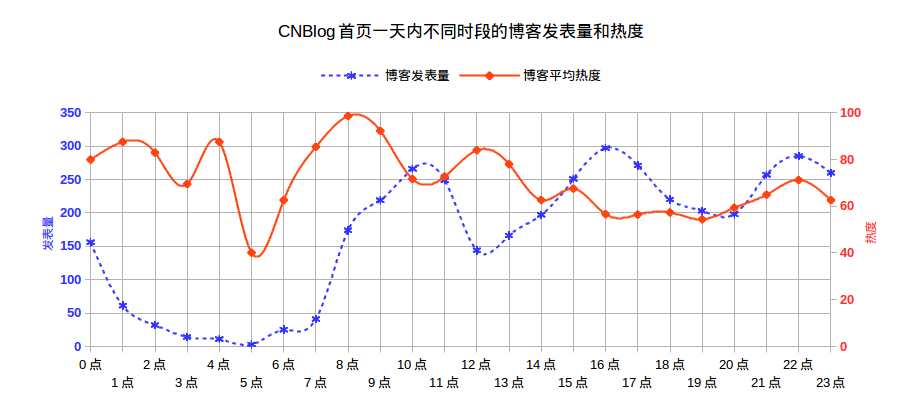
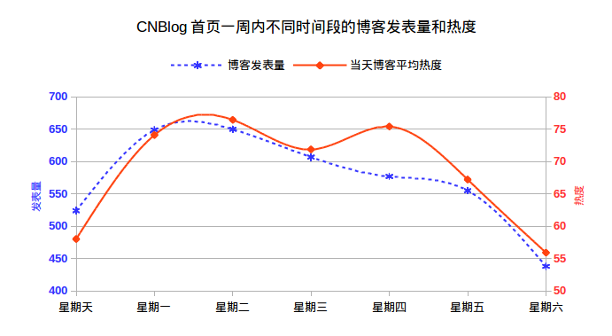

# CNBlog首页博客热度分析

# 前言

每个博客园的园友或许都会有这种经历：自己辛辛苦苦，认认真真的写了篇博客，然后满心欢喜的发到了博客园首页，当你以为大功告成坐等点击量暴表的时候，却发现自己的博文根本无人问津。那将是何等的痛苦:(

不要再自我怀疑，不要再自怨自艾，博客不火，不一定是博文内容不够严谨深入，也不一定是你能力不足，而可能仅仅是因为你选择了错误的发表时机。

本文基于博客园近3个月4000篇首页博文，运用大数据分析，机器学习，文本挖掘等先进技术，深入而细致的剖析决定博客热度的若干因素，让您从此也能写出精湛的技术博客，成为博客园的技术达人（做梦到此结束...）。

# 技术实现
经分析，博客园首页网页结构比较简洁，通过爬虫抓取[http://www.cnblogs.com/sitehome/p/your_page_num](http://www.cnblogs.com/sitehome/p/3) 连接下的内容，即可获取所有首页博文。本文采用的是[jsoup](https://jsoup.org/)这个Java HTML Parser进行的网页抓取。博客园页码只支持到200，每页20篇，也就是最多能够抓取4000篇首页博客。对数据进行清洗后存储到文件，供下一步分析。

由于数据量并不大，分析数据采用的是excel表格。不要觉得low，用表格来处理小规模数据，效果不亚于数据库。

# 分析结果

## 博友们一天之内喜欢什么时候发博客？
## 哪个时间段发的博客更容易火？

我们对一天中不同时间段发表的博客进行统计，然后计算每个小时内的博客发表量，以及当前这个小时每篇博客的平均热度。这里的热度是用来衡量一篇博文受欢迎程度的综合指标，计算公式为：

`hot=(recommend*10+comment*5+view)`

为避免离群点，当hot值超过1600时则按1600处理。上图中标注的热度（红色线）为对文章热度求平均之后，然后做归一化`(avg_hot/800*100%)`之后的结果。

从上图可以明显看出，**一天之内有三个时间段大家比较爱发博客**，分别是10:00左右，16:00左右和22:00左右，这分别对应的是上午上班时间，下午上班时间，和晚上加班时间。**一天内也有三个时间段大家不怎么爱发博客**，分别是1:00~7:00，12:00左右，19:00左右，分别对应大家的睡觉时间，午饭时间和下班时间。

什么时候发的博客更容易火呢？抛开凌晨那段时间不提（因为博客量太少），上图可以看出，早上8:00左右发的博客热度最高，中午12:00左右和晚上22:00左右也是个热度小高峰。

对比上图中的蓝线和红线，我们发现博客发表高峰和访问高峰（热度评估主要基于访问量，所以热度表示了访问量的趋势）并不总是成比例。具体表现如下：

> 1. 早上8:00是一天中访问量最高的时候，但博客发表并不是很多（上班路上大家刷刷博客？）
> 2. 上午10:00左右是博客发表的高峰，但访问量却呈下降趋势（忙着写自己的博客而忘记看别人的博客）
> 3. 中午12:00左右访问量很高，但博客发表量却出奇的低（吃饭的时候不写博客，倒是可以手机刷刷博客）

## 大家一周之内喜欢在哪一天发博客？
## 一周之内哪一天发的博客更容易火？

我们对一周中不同天发表的博客进行统计，然后计算每天的博客发表量，以及当天每篇博客的平均热度。

通过上图可以看出：

> 1. 星期一和星期二是博客发表的热潮（上班前两天不但工作积极，写博客也很积极）
> 2. 之后一直下降，到周六达到最低谷（终于盼来周末，谁还写博客！）。
> 3. 博客热度跟发表量基本吻合，可见工作日大家不但工作热情高，写博客和读博客的热情都不低。
> 4. 到了周末，写博客的人少，看博客的人更少！
> 5. 周四博客阅读量出现了回升，你可以帮忙想想是为什么。

上图意味着，**周末还是老老实实的出去玩吧，即使写了博客也不会有人看的**。特别是周六，千万不要在周六发表技术博客，切记切记！

# 总结
经过以上分析，我们得出结论：为了避免吃力不讨好的情况，发表博客一定要认准时机。

1. **博客想要火，就不能睡懒觉，因为你要在8:00钟左右发表博客。**
2. **更不能吃午饭，因为你还要在12:00左右发表博客。**
3. 当然，为了犒劳以下忙碌一周的你，**周末切记不要苦逼的写博客，因为即使写得再认真也不会有人看。**
4. **周一，周二以及周四，才是您发表博客的黄道吉日。**

以上四项基本原则，一定要牢记于心，切记不要轻易违背。否则没有点击量，你的博客还不如写道日记本里。

# 未来的工作

博客热度不仅跟发表时间有关，当然也跟博客内容，以及博主的个人影响力等诸多因素相关。希望各位博友能够加入更多分析。
